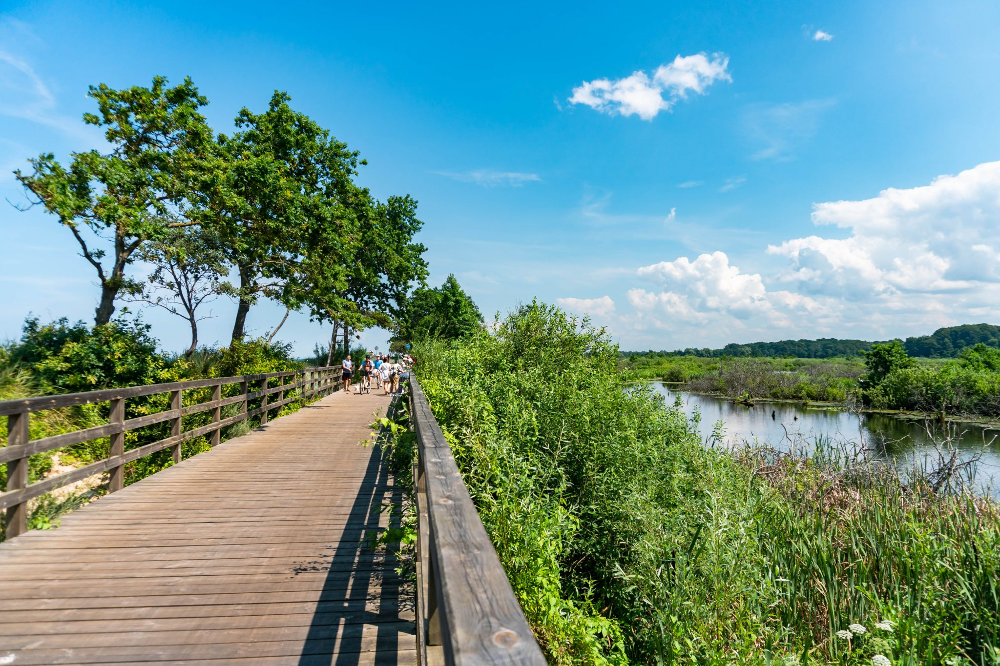

# Ogólna charakterystyka miasta {#ogolny}
## Historia miasta {#historia}
Osadnictwo na terenie obecnego Kołobrzegu sięga VII wieku, kiedy to powstała osada na Wyspie Solnej, gdzie pozyskiwano sól ze źródeł solankowych.
Była ona źródłem bogactwa okolicznej ludności, dzięki czemu w IX wieku przystąpiono do budowy grodziska na terenie obecnego Budzistowa (wieś na południowych obrzeżach miasta Kołobrzeg).
Miasto jest wspominane w kronikach Thietmara jako Solny Kołobrzeg (Salsae Colbergiensis), podkreśla to *solny rodowód* miasta.


Badania archeologiczne wskazują, że do X wieku grodzisko przekształciło się w ufortyfikowany gród o charakterze wczesnomiejskim [@historia_kołobrzeg], który był ważnym ośrodkiem polityczno-gospodarczym na wschód od ujścia Odry a na zachód od ujścia Wisły.
Świadczy o tym ustalenie na  zjeździe gnieźnieńskim diecezji kołobrzeskiej w 1000 roku, która  podporządkowana metropolii gnieźnieńskiej obejmowała całe Pomorze i jak wskazuje nazwa siedziba diecezji znajdowała się w Kołobrzegu.
Działalność misyjna połączona była z próbą utrwalenia zwierzchnictwa państwa Piastów nad Pomorzem Zachodnim.
Działania te nie przyniosły rezultatu i państwo Polskie utraciło zwierzchność nad Pomorzem Zachodnim w 1007 roku, tym samym przerywając działalność misjonarską (a co za tym idzie cywilizacyjną, mającą wpływ na kształt wczesnośredniowiecznego Kołobrzegu) aż do ponownego podporządkowania tych terenów przez Bolesława Krzywoustego w pierwszej połowie XII wieku.
W okresie rozbicia dzielnicowego Kołobrzeg znalazł się pod panowaniem duńskim, żeby następnie odzyskać niezależność pod władzą książąt pomorskich.


W 1255 roku książe pomorski Warcisław III lokował nowe miasto bliżej wybrzeża na prawie lubeckim. 
Dawny gród opuszczono a w pamięci przyszłych pokoleń teren ten został zapamiętany jako Stare Miasto (*Altstat*) [@historia_kołobrzeg_wiki].
Część osadników zagospodarowujących nową przestrzeń miejską pochodziło ze Starego Kołobrzegu, jednak sporą część nowych mieszkańców stanowili imigranci z miast hanzeatyckich - głównie z Gryfii (*Greifswald*), Lubeki i Brunszwiku. 
Napływ ludności niemieckojęzycznej spowodował że w okresie następnych 100 lat nastąpiła asymilacja rodzimej ludności słowiańskiej.
Nastąpiło przyjęcie nowych wzorców kulturowych, upowszechnienie się zachodnich rozwiązań technologicznych, gospodarczych i prawnych.
Nowe miasto założono na prawie lubeckim dlatego też początkowo w kołobrzeskim sądzie rozpatrywano jedynie sprawy w pierwszej instancji (apelacje składano do Gryfii, kasacje do Lubeki) jednak gdy liczba spraw w Kołobrzegu zaczęła wzrastać dokonano odpisu Kodeksu Prawa Lubeckiego i przywieziono go (odpis kodeksu) w uroczystych okolicznościach do miasta.
Co ciekawe Kołobrzeski odpis Kodeksu Prawa Lubeckiego liczy 192 artykuły z oryginalnych 237.
Kodeks ten obowiązywał formalnie do 1 czerwca 1794 roku.

```{r ryc7, echo=FALSE, fig.cap="Hipotetyczny widok Kołobrzegu na początku XV w. autorstwa J. Tężyckiego i M. Rębkowskiego. (Źródło: Robert Dziemba, Historia Kołobrzegu dla średniozaawansowanych, 2018)", out.width=400}
knitr::include_graphics("figures/widok_miasto.jpg")
```

W okresie średniowiecza, miasto regularnie się rozbudowywało.
Jeszcze pod koniec XIII wieku rozpoczęto realizację monumentalnej inwestycji, jaką była budowa kolegiaty.
Pierwszy ratusz powstał przy ul. Podgórnej (obecnie ulica Wąska).
Wiek później drewnianą zabudowę zaczęto zastępować zabudową murowaną.
Osuszono prawy brzeg Parsęty (ulica Rzeczna), na który przeszła ekspansja tkanki miejskiej.
Zbudowano mur obronny długości ponad 1500 metrów wraz z  dwiema basztami.
Wzmocniło to poczucie bezpieczeństwa mieszkańców, choć dzięki położeniu geograficznemu Kołobrzeg posiada naturalnie dobre warunki do obrony, od południa miasto chroniła rzeka, a od wschodu rozległe bagniska i tereny podmokłe.

W średniowieczu miasto bogaciło się na handlu solą, którą importowano zwłaszcza do północnej Wielkopolski. 
W XII i XIII wieku zmieniła się struktura własnościowa salin kołobrzeskich.
Początkowo duży udział w warzelniach miały klasztory i istytucje kościelne, jednak do 1300 roku, kiedy to powstało pierwsze na tych ziemiach bractwo solne głównymi właścicielami warzelni stali się mieszkańcy [@heider].
W XV wieku, Kołobrzeg stał się potęgą gospodarczą nad Bałtykiem, uzależniając od siebie inne mniejsze miasta.


Okres prosperity trwał do wojny trzydziestoletniej (*1618-1648*).
Mimo prób zachowania neutralności w tym konflikcie Księstwo Pomorskie stało się areną działań wojennych w 1627 roku, kiedy to uległo i zgodziło się na zakwaterowanie wojsk cesarskich. 
Rozpoczęło to okupacje miasta, która spustoszyła miasto. 
Doprowadziło to do samowoli żołnierzy, którzy dopuszczali się gwałtów, rabunków i podpaleń. 
W 1630 roku od czerwca do września w mieście wybuchła zaraza, która zabiła 3,5 tysiąca ludzi.
Na domiar złego we wrześniu tego samego roku wybuchł wielki pożar, który pochłonął południowo-zachodnią część miasta.
O rozmiarze trudów z jakimi zmagali się mieszkańcy świadczy radość z jaką powitali w 1631 roku okupacje szwedzką miasta, po kapitulacji garnizonu wojsk cesarskich.
Szwedzi przystąpili do fortyfikacji Kołobrzegu, tworząc na zewnątrz średniowiecznych 
murów wielobok bastionowy.
Książe pomorski Bogusław XIV zmarł bezpotomnie i w wyniku pokoju westfalskiego, kończącego wojne trzydziestoletnią podzielono Księstwo Pomorskie na Pomorze Przednie, które przypadło szwedom oraz na Pomorze Przednie, które otrzymał elektor brandenburski.
Kołobrzeg będący enklawą szwedzką w wyniku rokowań przeszedł pod władze Brandenburgii dopiero 5 lat po zakończeniu wojny.
Kołobrzeg dekretem zamieniono w twierdze i przez następne lata rozbudowano fortyfikacje oraz port morski, będący portem macierzystym floty brandenburskiej.

```{r ryc1, echo=FALSE, fig.cap="Plan twierdzy kolobrzeg 1687 (Źródło:https://twierdzakolobrzeg.pl)", out.width=400}
knitr::include_graphics("figures/plan_twierdzy_kolobrzeg_1687.jpg")
```
Od tej pory Kołobrzeg jako twierdza był świadkiem najważniejszych konfliktów zbrojnych w Europie.
Podczas wojny siedmioletniej (1756–1763), Kołobrzeg był trzykrotnie oblegany przez Rosjan (trwała także blokada morska miasta). 
Zdobyli oni miasto pod koniec 1761 roku i przez pół roku okupowali miasto, mimo zniszczeń wojennych dobrze zapisując się w pamięci mieszkańców [@historia_kołobrzeg].
Kołobrzeg w 1762 roku *wrócił* pod władanie Pruskie i w następnych latach poczyniono znaczne inwestycje w rozbudowanie nowoczesnych fortyfikacji.

```{r ryc2, echo=FALSE, fig.cap="Plan twierdzy Kołobrzeg po rozbudowie w 1770 roku (Źródło:https://twierdzakolobrzeg.pl)", out.width=400}
knitr::include_graphics("figures/twierdza_koł.jpg")
```

Podczas wojen napoleońskich twierdza w Kołobrzegu stała się symbolem oporu, kiedy to po klęskach armii pruskiej pod Jeną i Auerstädt oraz po upadku Berlina załoga twierdzy Kołobrzeg odmówiła kapitulacji i przez 4 miesiące skutecznie broniła się.
SKutkowało to dużymi zniszczeniami w mieście, ale wydarzenia te stały się później ważnym niemieckim symbolem narodowym.

```{r ryc3, echo=FALSE, fig.cap="Plan oblężenia Twierdzy Kołobrzeg w 1807 roku (Źródło:https://twierdzakolobrzeg.pl)", out.width=400}
knitr::include_graphics("figures/Kolobrzeg_napoleon.jpg")
```

Po 1807 roku nastąpiła ponowna odbudowa miasta, przy czym priorytetem była odbudowa fortyfikacji.
Zmodernizowano sposób produkcji w Kołobrzeskich warzelniach soli, które od 1801 roku należały do pruskiego rządu.
Mimo starań rządu produkcja soli z solanki w Kołobrzegu okazała się nierentowna i w 1858 roku zlikwidowano produkcje soli, kończąc wielowiekową tradycje warzelnictwa.
Jednak nie był to koniec wpływu soli na rozwój miasta.
Już w 1803 roku powstał Zakład Kąpieli Morskich i w kolejnych latach powstały domy zdrojowe dla kuracjuszy.
Dlatego też, kilka lat po zlikwidowaniu warzelni źródła solankowe przekazano do dyspozycji uzdrowiska [@heider]. 

W latach 1832–1836 przeprowadzono ostatnią wielką modernizację fortyfikacji Twierdzy Kołobrzeg.
Zbudowano także istniejący po dziś dzień neogotycki ratusz, zaprojektowany przez wybitnego niemieckiego architekta Karla Friedricha Schinkela.

W 1873 podjęto decyzje o likwidacji twierdzy Kołobrzeg, 15 lat później podjęto decyzje o likwidacji morskiej Twierdzy Kołobrzeg.
Oznaczało to przejęcie gruntów, które należały do wojska przez władze miejskie.
Przez następne 30 lat trwał proces przekształcania Kołobrzegu w "standardowe" miasto. Zniwelowano wały forteczne, zasypano fosy i na ich miejsce wytyczono nowe ulice.
Zabudowania forteczne, których nie rozebrano otrzymały funcke kulturalną, gastronomiczną, mieszkalną lub pamiątkową [@historia_kołobrzeg].
Decyzja ta wpłynęła pozytywnie na rozwój funkcji uzdrowiskowej miasta, wraz z wytaczaniem nowych ulic powstawały zakłady zdrojowe, kurorty i pensjonaty. 

Podczas I wojny światowej, działania wojenne ominęły Kołobrzeg. 
Na czas wojny w mieście zorganizowano zaplecze medyczne.
Mimo, że miasto nie ucierpiało w wyniku walk to sytuacja Kołobrzegu po wojnie była trudna. 
Podupadła gospodarka, ponieważ zamarła branża turystyczna.
W przegranych Niemczech szerzyło się bezrobocie, bieda oraz hiperinflacja, która wpłynęła na sytuacje mieszkańców ówczesnego Kołobrzegu.

Podczas II wojny światowej Kołobrzeg ponownie w swojej historii został mianowany twierdzą. 
Miasto zostało umocnione i zbudowano system barykad.
W dniach 4–18 marca 1945 roku stoczono krwawą bitwę o Kołobrzeg.
Bitwa miała charakter walk miejskich i w jej wyniku zniszczono Kołobrzeg w 80-95% w zależności od źródeł.

```{r ryc4, echo=FALSE, fig.cap="Widok na Kołobrzeg w 1945 roku (Źródło:https://twierdzakolobrzeg.pl)", out.width=400}
knitr::include_graphics("figures/kolobrzeg_wojna.jpg")
```

W okresie od zdobycia miasta w marcu do 31 maja -kiedy to miasto przekazano polskim władzom - dokonywano zorganizowanego rabunku mienia i wywozu majątku pozostawionego przez mieszkańców.
Jeszcze miesiąc po zakończeniu walk miasto wciąż spowijała łuna pożarów.
Grabież tak wspomina Ludwik Herczak-Osmoliński, który był był w Kołobrzegu 20 kwietnia 1945 roku (@kołobrzeg_cytat):

> "W parku stała nieobliczalna ilość sprzętu wojskowego, armat, czołgów, samochodów pancernych, amunicji. Wśród tego żelastwa walały się trupy żołnierskie i zabite konie. Przeskoczyliśmy wydmy i zobaczyliśmy pas wzburzonego morza. W pobliżu brzegu widać było zatopione okręty i stateczki niemieckie. Po kilku dniach rozejrzeliśmy się po mieście. Na ulicy Dworcowej, w gruzowiskach domów leżały dziesiątki trupów polskich żołnierzy. Nie mieli na sobie płaszczy, tylko drelichowe mundury i czapki polowe z orzełkami wojska Berlinga. Na ich nogach zobaczyłem parciane obuwie. Druga, duża grupa polskich żołnierzy leżała w piwnicach domu przy skrzyżowaniu ulicy Armii Krajowej i Łopuskiego. Naliczyłem ich przeszło osiemdziesiąt. Trupy ludności cywilnej i żołnierzy niemieckich walały się wszędzie, na ulicach i wokół domów, nikt ich nie uprzątnął.
Rosjanie buszowali w mieście. Na rampę kolejową, której dzisiaj już nie ma, a stała ona w miejscu dzisiejszych pawilonów handlowych przy ul. Kolejowej (kładka dla pieszych), dojeżdżały samochody ciężarowe i dowożono do towarowych wagonów dosłownie wszystko. Tę wywózkę łupów wojennych pilnowali żołnierze Armii Czerwonej. Wzdłuż ulicy Unii Lubelskiej stały w rzędach po jednej i drugiej stronie jezdni kombajny zbożowe, maszyny rolnicze, fortepiany, meble, maszyny do szycia i sprzęt gospodarczy. Było tego tysiące. Wywózka trwała bez przerwy""

## Położenie (administracyjne, geograficzne) {#polozenie}

Miasto Kołobrzeg jest gminą miejską położoną w północno-zachodniej części Polski, na Pomorzu Zachodnim, w północnej części województwa zachodniopomorskiego, w powiecie
kołobrzeskim.
Miasto Kołobrzeg stanowi gminę miejską Kołobrzeg i sąsiaduje z gmina wiejska o tej samej nazwie (Kołobrzeg) oraz od wschodu z gminą wiejską Ustronie Morskie.
Gmina miejska Kołobrzeg podzielona jest na 9 osiedli (patrz Rycina \@ref(fig:ryc8)).

```{r ryc8, echo=FALSE, fig.cap="Podział administracyjny Kołobrzegu (Źródło: wikipedia.org)", tidy=TRUE, tidy.opts=list(width.cutoff=60), out.width = '105%'}
knitr::include_graphics("figures/Kolobrzeg_administrative_division_2005.png")
```


Jest miastem nabrzeżnym Morza Bałtyckiego, gdzie swe ujście ma rzeka Parsęta, która stanowi naturalną granicę rozdzielającą strefę brzegową Wybrzeża Trzebiatowskiego i Wybrzeża Słowińskiego.
Rzeźba terenu wznosi się w górę w kierunku południowym, a krajobraz jest urozmaicony dzięki dolinie rzecznej Parsęty.
Na terenie gminy miejskiej naturalnie dominują gleby torfowe i bielicowe, natomiast w strefach zurbanizowanym występują zwarte gleby o charakterze antropogenicznym (usypiska, sztucznie zasilane plaże i urbisole). 

## Środowisko przyrodnicze {#przyr}

Miasto Kołobrzeg w dokumentach planistycznych i strategicznych uwzględnia aspekt środowiskowy.
Efektem działań władz lokalnych jest rozwój terenów zielonych, na przestrzeni dekady (2009- 2019) ich udział w ogólnej powierzchni zwiększył się niemal dwukrotnie (5,1% do 9%).
Jednocześnie gospodarczy i turystyczny rozwój Kołobrzegu wywiera istotną presję na
system przyrodniczy miasta i jakość środowiska.
Kurczą się zasoby przestrzeni miasta, a lokalny system przyrodniczy poddawany jest coraz większej presji ze strony przybywających turystów (@smartcity).

Ekopark Wschodni znajduje się we wschodniej części miasta, na terenach leśnych oddzielających Kołobrzeg od osiedla Podczele.
Teren ten był dawniej administrowany przez wojsko, natomiast od 1996 został powołany ekopark i jest częścią Trzebiatowsko-Kołobrzeskiego Pasa Nadmorskiego.
Obejmuje 381 hektarów na których znajdują się unikalne solne torfowiska zamieszkane przez wyjątkowe gatunki zwierząt i roślin.
Teren parku jest ważną ostoją ptaków, gniazduje tu i żeruje ok 100 gatunków ptaków, takich jak bąk, rybołów, czapla biała, żuraw, rybitwa rzeczna, gęś gęgawa czy łabędź niemy (@ekopark).

```{r ryc12, echo=FALSE, fig.cap="Ekopark wschodni (Źródło: https://krajewscywpodrozy.pl/wp-content/uploads/2021/07/Rejs-statkiem-Kolobrzeg-2-scaled.jpg)", tidy=TRUE, tidy.opts=list(width.cutoff=60), out.width = '105%'}

```

## Klimat {#klimat}
Istotną dla rozwoju turystyki oraz dla rozwoju portu morskiego jest szczególny klimat, którym cieszy się Kołobrzeg.
Kołobrzeg znajduje się w krainie klimatycznej Trzebiatowskiej i Kołobrzesko-Darłowskiej przez co cechuje się większą ilością dni z dużym zachmurzeniem oraz większymi opadami atmosferycznymi.
Temperatura w okresie od maja do lipca jest względnie niższa- występuje mniej dni gorących.
Natomiast zima oraz przymrozki zaczynają się późno i nie wiele jest dni zimowych z utrzymującą się pokrywą śnieżną.
Powyższe cechy klimatyczne sprawiają, że Kołobrzeg jest miastem o jednym z najniższych średnich rocznych amplitud klimatycznych w Polsce [@strategia_promocji].
Warunki te za sprawą ocieplenia klimatu zmieniają się, jednak wydaje się że niska roczna amplituda temperatur pozostanie cechą charakterystyczną Kołobrzegu, co sugerują badania pod redakcją Joanny Wbig oraz Ewy Jakusik [@wibig], według których zwiększa się średnia częstość odczucia cieplnego „ciepło”, „bardzo ciepło” latem i wiosną oraz zmniejsza się częstość odczuć przeciwnych w zimę.

```{r ryc11, echo=FALSE, fig.cap="Tabela klimatu dla Kołobrzegu (Źródło: wikipedia.org)", tidy=TRUE, tidy.opts=list(width.cutoff=60), out.width = '105%'}
knitr::include_graphics("figures/tabela_klimatu.jpg")
```


## Infrastruktura transportowa  {#inf_trans}
Kołobrzeg jest korzystnie usytuowany pod względem komunikacyjnym.
Posiadając połączenia drogowe i kolejowe z innymi regionami kraju. 
Do Kołobrzegu prowadzą drogi krajowe i ekspresowe (S6, S11, DK11), wojewódzkie (102, 163), powiatowe oraz gminne. 
Istnieje dobrze rozwinięta sieć połączeń kolejowych, do Kołobrzegu można się dostać koleją bezpośrednimi pociągami między innymi ze Szczecina, Koszalina, Gdańska, Warszawy i Poznania.

Transport zbiorowy na terenie miasta Kołobrzeg realizowany jest za pośrednictwem Komunikacji Miejskiej w Kołobrzegu Sp. z o.o. (ul. Solna 2), której właścicielem jest Gmina Miejska Kołobrzeg.
Obecnie na terenie miasta funkcjonuje 11 linii autobusowych, na które bilety można zakupić tradycyjnie w formie papierowej, a także poprzez aplikacje mobilne oraz poprzez płatność Kołobrzeską Kartą Mieszkańca. 

W pobliżu Kołobrzegu funkcjonuje lotnisko Kołobrzeg-Bagicz, jest to cywilne lotnisko o charakterze sezonowym- czynne od 1 czerwca do 30 września.
W 2015 z kołobrzeskiego lotniska skorzystało 300 samolotów, głównie lekkie samoloty zabierające do 10 pasażerów.
Najbliższy port lotniczy znajduje się w Goleniowie, do którego istnieje połączenie szynobusem z Kołobrzegu (@lotnisko).

W planach władz lokalnych jest przebudowanie sieci komunikacyjnej w mieście w celu lepszego połączenia najważniejszych dzielnic miasta z dworcem kolejowym- stworzenie centrum przesiadkowego, skoordynowanego czasowo z transportem publicznym oraz skomunikowanie z parkingami buforowymi oraz centrami handlowymi.

Dużym problemem w zakresie infrastruktury transportowej jest obciążenie lokalnego układu komunikacyjnego przez indywidualny transport kołowy w sezonie turystycznym. 
Powoduje to nadmierną eksploatację systemu dróg i powstawanie zjawiska kongestii (natężenie ruchu przekracza przepustowość infrastruktury), co ma wpływ na jakość nawierzchni drogowych, stan infrastruktury towarzyszącej oraz nasilające się negatywne skutki nadmiernego ruchu komunikacyjnego dla środowiska i mieszkańców. 
Z problemem tym związany jest deficyt miejsc parkingowych.
Rozwiązaniem tego problemu jest rozwój komunikacji publicznej, w tym rowerowej.
Ta choć generalnie dobrze rozwinięta jest często, nie dostatecznie znana wśród przyjezdnych (@smartcity).


### Informacja o Rowerze Miejskim (historia, cennik, ilość rowerów, mapa)  {#rower_M}

W 2016 roku miasto Kołobrzeg uchwaliło *Studium rozwoju infrastruktury rowerowej w Kołobrzegu*, dokument został opracowany przez krakowski oddział stowarzyszenia inżynierów i techników komunikacji. 
Jednym z zaleceń studium rowerowego było powstanie roweru miejskiego.
Zalecenie to zostało zrealizowane w 2017 roku.
Obsługą rowerów miejskich zajmuje się firma NextBike.
W 2018 roku powstała stacja sponsorska "Park Handlowy Albatros", dysponująca 10 rowerami i będąca pierwsza, jak dotychczas jedyną stacją rowerową powstałą dzięki zaangażowaniu podmiotu prywatnego.
Na terenie miasta do 2020 roku znajdowało się 13 stacji rowerowych (patrz Rycina \@ref(fig:ryc9)), a system roweru miejskiego dysponował 135 rowerami - 10 rowerów "Park Handlowy Albatros" (patrz Rycina 2.9)  (@kolobrzeskirower).
Lokalizacje stacji rowerowych jest uzasadniona, stacje znajdują się w bliskiej odległości do terenów rekreacyjnych (parki, stadion/amfiteatr) oraz przy ważnych węzłach komunikacyjnych (patrz Rycina \@ref(fig:ryc9)) .

```{r rycina29 , echo=FALSE, fig.cap="Stacje rowerowe w Kołobrzegu w 2020 roku (Źródło: Opracowanie własne)", tidy=TRUE, tidy.opts=list(width.cutoff=60), out.width = '105%'}
knitr::include_graphics("figures/Kołobrzeg_stacje_git.png")
```

```{r ryc9, echo=FALSE, fig.cap="Stacje rowerowe w 2020 roku oraz obiekty rekreacyjne (Źródło: Opracowanie własne)", tidy=TRUE, tidy.opts=list(width.cutoff=60), out.width = '105%'}
knitr::include_graphics("figures/stacje_Kol_sat-2.jpg")
```


Obecnie (2021) stacja "Park Handlowy Albatros" jest nieczynna, a więc użytkownicy roweru miejskiego dysponują pierwotną liczbą 12 stacji oraz 125 rowerami miejskimi.

Cena za korzystanie z usług Kołobrzeskiego Roweru Miejskiego zależy od posiadania Kołobrzeskiej Karty Mieszkańca. 
kołobrzeżaninie mogą korzystać do 40 minut za darmo, czas ten umożliwia w praktyce dostanie się za darmo do dowolnej stacji w Kołobrzegu (w tym do oddalonej stacji Podczele). Powyżej 40 minut a do godziny cena wynosi 2zł, do dwóch godzin 3 zł, natomiast każda kolejna godzina kosztuje 10 zł.
Cennik dla osoby nie posiadającej Kołobrzeskiej Karty Mieszkańca jest podobny z tą różnicą, że przejazd bez opłat jest do 20 minut.
Przed korzystaniem z roweru miejskiego należy uiścić opłate inicjalną w wysokości 10 zł (@kolobrzeskirower).

###	Infrastruktura rowerowa  {#inf_rower}
Infrastruktura rowerowa to wszystkie podstawowe urządzenia, usprawnienia służące obsłudze ruchu rowerowego. 
Dzieli się na twardą, miękką oraz niewidzialną. 
Infrastruktura rowerowa twarda to taka, która obejmuje konkretne rozwiązania dla rowerzystów- wydzielone ścieżki rowerowe, sygnalizacja dla rowerzystów, stojaki i parkingi rowerowe itp.
Infrastruktura miękka to taka, która wprowadza  rozwiązania dla rowerów za pomocą oznakowania poziomego. 
Infrastruktura niewidzialna to rodzaj infrastruktury rowerowej, którego podstawową funkcją jest służenie innym członkom ruchu drogowego, który uwzględnia jednocześnie potrzeby rowerzystów. 
Przykładem niewidzialnej infrastruktury rowerowej są ronda z jednym pasem ruchu, dzięki czemu eliminuje się lewoskręty, będące jedną z najczęstszych przyczyn wypadków rowerowych.
Innym przykładem takich rozwiązań są ograniczenia prędkości do 30 km/h oraz strefy mieszkalne wyrównujące prędkość samochodów do rowerzystów (@stojaknarower).

Kołobrzeg jako miasto posiada optymalne warunki do rozwoju ruchu rowerowego:

- płaskie ukształtowanie terenu,

- nie zanieczyszczone powietrze,

- dużą liczbę turystów odwiedzających miasto przez cały rok,

- skalę gwarantującą odległość pomiędzy celem i źródłem podróży nie
przekraczającą 4km (@studium_rower)

Miasto Kołobrzeg pod względem infrastruktury rowerowej twardej wypada dość dobrze w porównaniu do innych miast w Polsce- istnieje relatywnie rozwinięta sieć dróg rowerowych. Miasto sukcesywnie przy przebudowach ulic stawia nowe stojaki rowerowe - w 2020 roku przy przebudowie ul. Zwycięzców, ul. 18 Marca (@raport_2020). 
Powstające ścieżki spełniają zalecenia studium rowerowego- zbudowane są z masy mineralno–asfaltowej, rezygnacja z kątów prostych na rzecz łuków itp. 

Przez wybrzeże Kołobrzegu prowadzi szlak rowerowy R-10 (*Nadmorski Szlak Hanzeatycki*), który biegnie od Świnoujścia aż do Helu i jest częścią międzynarodowego szlaku    EuroVelo. Na rozbudowę transgranicznej ścieżki, w tym zamontowanie liczników umożliwiających pomiar ruchu rowerowego miasto Kołobrzeg współpracuje z gminami ościennymi oraz gminami zagranicznymi w ramach pozyskania środków z Europejskiego Funduszu Rozwoju Regionalnego (@raport_2019).


(@studium_rower)

## Charakterystyka gospodarcza miasta  {#gosp}

Kołobrzeg jest miastem o długiej historii turystyczno-uzdrowiskowej (patrz Rozdział \@ref(historia)) co wynika z położenia i zasobów naturalnych (złoża borowiny, wody mineralnej i solanki).
Obecnie na terenie miasta znajdują się 21 uzdrowisk (2019), zapewniające ponad 6200 miejsc noclegowych.
O charakterze Kołobrzegu i jego turystycznej funkcji świadczy ponad 17600 miejsc noclegowych co wpływa na wysoki wskaźnik zasobów mieszkaniowych na 1000 mieszkańców – 548 mieszkań, przy średniej polskiej 386 mieszkań (2018).
Wartość na sukcesywnie rosła w latach 2012-2019, adekwatnie do liczby turystów -z 350 856 do 591 985 (@smartcity).

Mieszkańcy Kołobrzegu wyróżniają się przedsiębiorczością, na terenie gminy jest znacznie więcej firm zajmujących się handlem i naprawami (sekcja G) oraz świadczących usługi gastronomiczne i zakwaterowanie (sekcja I) niż w przeciętnym Polskim mieście.
Wynika to z powiązania firm handlowych z branżą portową oraz firm w sekcji I z branżą turystyczną.
Według badań z 2011 roku ponad 55% przedsiębiorców uważa Kołobrzeg za dobre miejsce do prowadzenia działalności gospodarczej i tylko niecałe 19% ocenia Kołobrzeg negatywnie (@eurotest).

Kołobrzeg na tle innych miast o znaczącej funkcji turystycznej wyróżnia się wysokim odsetkiem osób pracujący w sektorze usług, który sukcesywnie rósł- z 66,3% w 2014 roku do 67,9% w 2018 (@smartcity). 

Strukturalny charakter gospodarki Kołobrzegu okazał się wrażliwy na zaburzenia przepływu osób i towarów spowodowane Covid-19.
Bezrobocie w 2020 roku wzrosło czterokrotnie w porównaniu z rokiem poprzednim.
Sukces uzdrowiskowy i turystyczny Kołobrzegu "zaciemnił" możliwość rozwoju branż opartych na korzystnej lokalizacji nadmorskiej, funkcji logistycznej, czy też w branży innowacyjnej - Kołobrzeg cechuje niski udział podmiotów sektora kreatywnego.
Jest to spowodowane wysokimi kosztami życia mieszkańców miasta, wąskim profilem gospodarczym Kołobrzegu oraz brakiem wyższej uczelni co spowodowało odpływ młodych ludzi.
