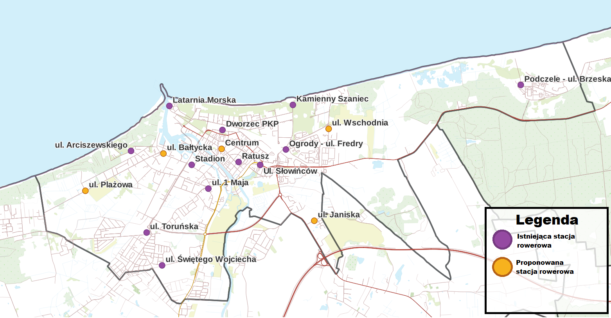
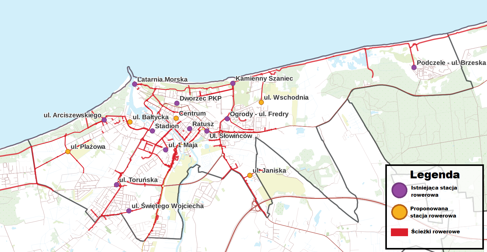
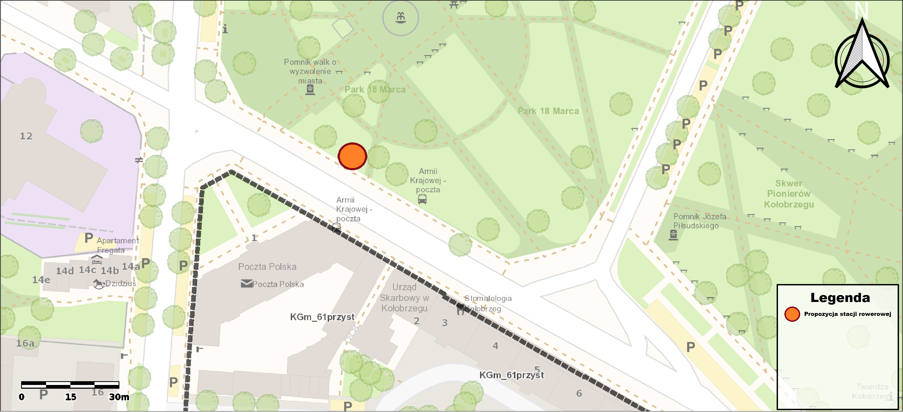
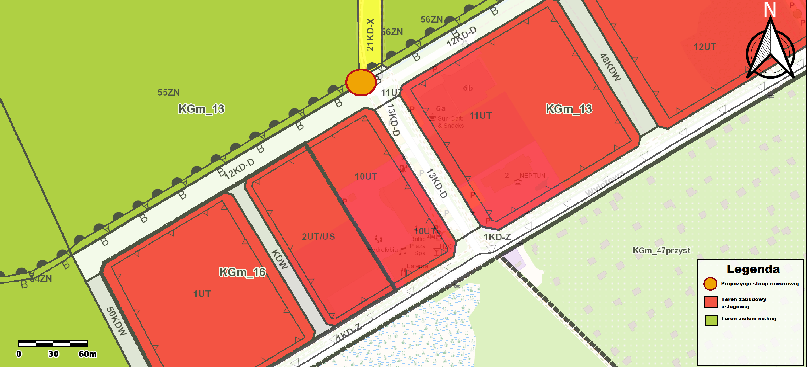
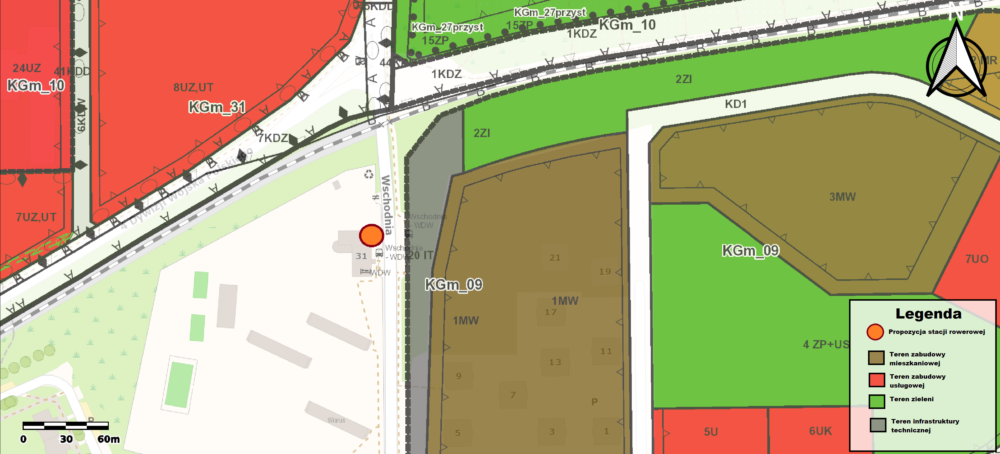

# Koncepcja zagospodarowania {#koncepcja_zag}


## Projekt koncepcji

Zgodnie z analizą wypożyczeń oraz wynikami ankiet zdecydowano się stworzyć koncepcje, zakładającą rozwój istniejącej sieci stacji roweru miejskiego.

Propozycje stacji:

* Centrum- przy przystanku *Armii Krajowej- poczta*

* ul. Bałtycka- na przystanku *Bałtycka przy Wylotowej*

* ul. Wschodnia - na przystanku *Wschodnia WDW*

* ul. Janiska przy Rodzinnych Ogródkach Działkowych - w pobliżu przystanku *Janiska- osiedle*

* ul. Plażowa - przy Wylotowej w stronę Grzybowa 

Założeniem projektowym nowych stacji była ich spójność z przystankami komunikacji miejskiej oraz możliwa dostępność terenów zieleni w bliskiej odległości od proponowanej stacji. 


```{r ryc40 , echo=FALSE, fig.cap="Istniejące i proponowane stacje rowere (Źródło: Opracowanie własne)", tidy=TRUE, tidy.opts=list(width.cutoff=60),out.width = '105%'}

```


```{r ryc41 ,warning=FALSE, echo=FALSE, fig.cap="Drogi rowerowe oraz drogi gdzie rowery są dozwolone wraz z isniejącymi oraz proponowanymi stacjami (Źródło: Opracowanie własne)", comment= "Źródło własne", tidy=TRUE, tidy.opts=list(width.cutoff=60), out.width = '105%'}

```

Propozycja jest zgodna z Strategią Smart City dotyczącej obszaru inteligentnej Mobilność i zakładający powstanie spójnej sieci atrakcyjnych ciągów rowerowych oraz z postulatem, że inicjatywa Kołobrzeskiego Roweru Miejskiego powinna być stale rozwijana, zarówno w aspekcie zwiększania zasięgu sieci stacji, jak i jej zagęszczenia.

```{r ryc42 , echo=FALSE, fig.cap="Otoczenie proponowanej stacji Bałtycka, wraz z planem miejscowym- jeśli istnieje (Źródło: Opracowanie własne)", tidy=TRUE, tidy.opts=list(width.cutoff=60), out.width = '105%'}
knitr::include_graphics("figures/mapki_poglad/Bałtycka_l.png")
```
Stacja Bałtycka ma znajdować się niedaleko skrzyżowania Bałtyckiej z ulicą Wylotową w pobliżu przystanku autobusowego *Bałtycka przy Wylotowej*. Usytuowana jest korzystnie w drodze ze stacji Stadion na stacje Arciszewskiego (przy jednym z wejść do parku Imienia Jedności Narodowej), jednocześnie będąc 300 metrów od wyżej wymienionego parku. Jest dogodną stacją w drodze na proponowaną stacje Plażową, którą usytuowano także w pobliżu ulicy Wylotowej (patrz Rycina 5.6).
```{r ryc43 , echo=FALSE, fig.cap="Otoczenie proponowanej stacji Centrum, wraz z planem miejscowym- jeśli istnieje (Źródło: Opracowanie własne)", tidy=TRUE, tidy.opts=list(width.cutoff=60), out.width = '105%'}

```
Proponowana stacja Centrum znajduje się w pobliżu przystanku *Armi Krajowej - poczta*, przy placu 18 marca, który otacza stacje. Znajduje się w połowie drogi między istniejącymi stacjami rowerowymi - *Dworzec PKP* i *Ratusz*, a zagęszczenie stacji rowerowych w Centrum było jednym z postulatów wynikających z ankiety przeprowadzonej wśród mieszkańców Kołobrzegu. 
```{r ryc44 , echo=FALSE, fig.cap="Otoczenie proponowanej stacji Janiska, wraz z planem miejscowym- jeśli istnieje (Źródło: Opracowanie własne)", tidy=TRUE, tidy.opts=list(width.cutoff=60), out.width = '105%'}
knitr::include_graphics("figures/mapki_poglad/Janiska_l.png")
```
Stacja Janiska znajduje się w pobliżu przystanku autobusowego *Janiska osiedle*. Położona jest w sąsiedztwie osiedla na ulicy Rzemieślniczej, rodzinnych ogródków działkowych, terenów zielonych oraz zabudowy o charakterze usługowym od północy. Teren nie jest objęty palnem miejscowym.


```{r ryc45 , echo=FALSE, fig.cap="Otoczenie proponowanej stacji Plażowa, wraz z planem miejscowym- jeśli istnieje (Źródło: Opracowanie własne)", tidy=TRUE, tidy.opts=list(width.cutoff=60), out.width = '105%'}

```

Stacja Plażowa znajduje się w północno-zachodniej części miasta w pobliżu ulicy Wylotowej, biegnącej w stronę sąsiedniego Grzybowa. 
Stacja w kierunku na Grzybowo była jednym z postulatów jakie wynikają z ankiety, a jej położenie w niedalekiej odległości od plaży sugeruje o możliwym dużym natężeniu ruchu rowerowego. 
Proponowana stacja znajduje się pobliżu terenów zieleni, stacji ładowania pojazdów elektrycznych oraz zabudowy usługowej- głównie hoteli takich jak *Neptun*, *Sun & Snow Resorts - Kołobrzeg* i *Baltic Plaza Hotel Medi SPA&fit*. 
W pobliżu znajduje się droga rowerowa prowadząca w stronę drogi rowerowej R-10 oraz nad Plaże Zachodnią Radzikowo.

```{r ryc46 , echo=FALSE, fig.cap="Otoczenie proponowanej stacji Wschodnia, wraz z planem miejscowym- jeśli istnieje (Źródło: Opracowanie własne)", tidy=TRUE, tidy.opts=list(width.cutoff=60), out.width = '105%'}

```


Stacja Wschodnia, znajduje się na ulicy Wschodniej biegnącej na osi północ-południe w pobliżu skrzyżowania z Dywizji Wojska Polskiego, która biegnie w stronę centrum miasta.
Ulica wschodnia łączy wiele osiedli z terenem nadmorskim i okolicznymi apartamentami. Proponowana stacja znajduje się w sąsiedztwie osiedla na ulicy Generała maczka oraz niezagospodarowanych terenów zieleni na północy wschód od stacji (głównie tereny bagniste).
W pobliżu stacji znajduje się przystanek autobusowy, Wojskowy Dom Wypoczynkowy oraz tory kolejowe (wraz z kładką pieszo-drogową).
Proponowana stacja znajduje się w optymalnej odległości od pobliskich stacji wypożyczeń Roweru Miejskiego *Kamienny Szaniec* oraz *Ogrody - ulica Fredry*, które zgodnie z analizą (patrz rozdział \@ref(analizy)) cechują się dużym natężeniem ruchu rowerowego.
